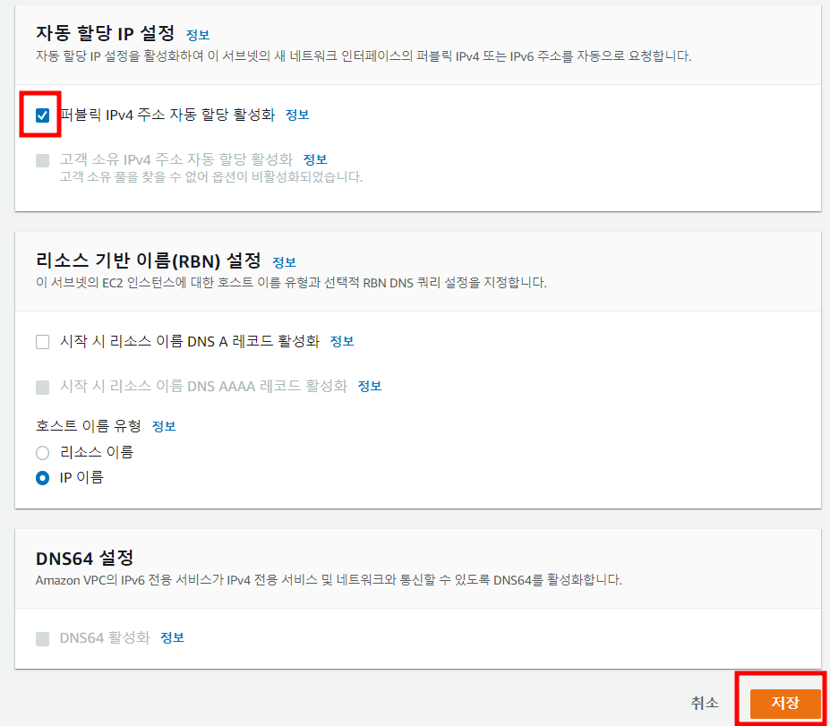
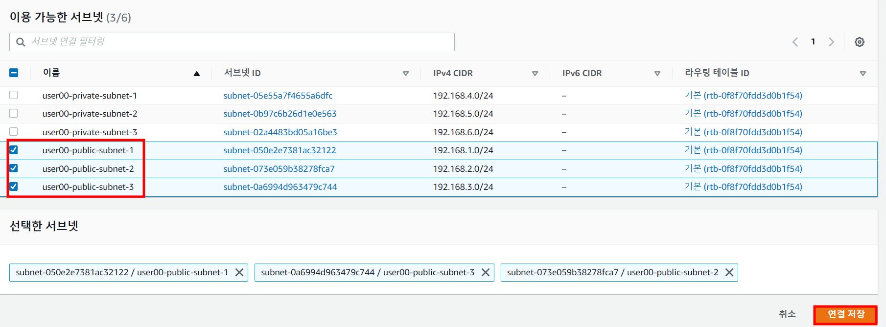
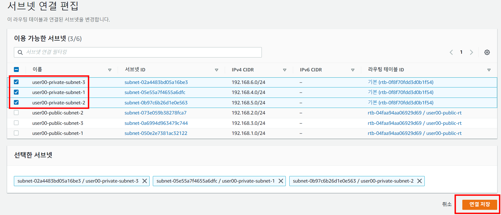
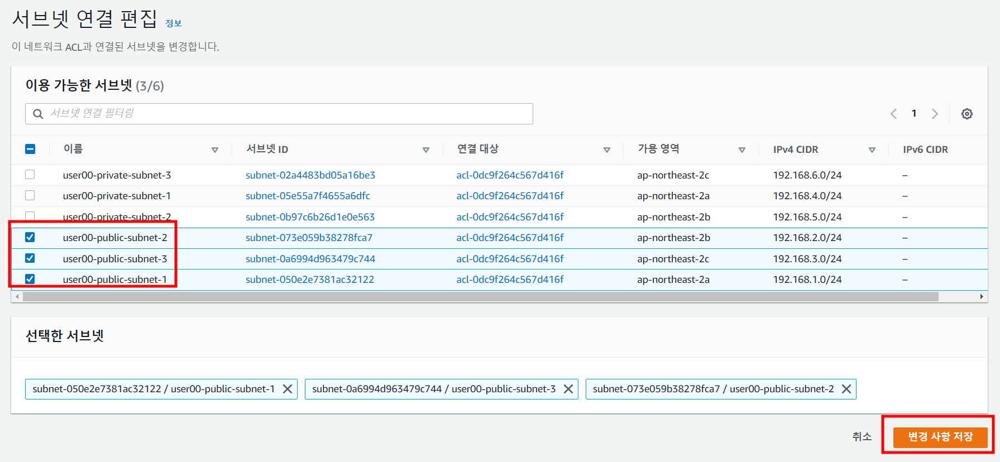

# Task 1 - AWS VPC(network) 구성

> vpc, subnet, internetgateway, routing table, network acl, NAT gateway

1. aws 로그인 


2. 우측 상단 리전을 서울로 변경


3. AWS Console - VPC 서비스 - VPC - VPC 생성 클릭


4. VPC만 선택, 이름란에 user##-vpc 입력, IPv4 CIDR 란에 192.168.0.0/16 입력 후 나머지는 기본값으로 둔채 하단 VPC 생성 클릭


필터링 검색란에 user## 을 검색하고 하단에 출력되는 vpc를 선택 후 작업, vpc 설정 편집 클릭


아래 그림처럼 선택후 저장 클릭


5. 좌측 메뉴 서브넷 - 우측 서브넷 생성 클릭 


6. vpc id 를 클릭하고 user## 을 검색하여 4번에서 생성한 본인의 vpc 선택


7. 하단 서브넷 설정에서 총 4개의 subnet 생성

```
서브넷 이름 : user##-public-subnet-1
가용영역 : ap-northeast-2a
IPv4 CIDR : 192.168.1.0/24
```

입력 후 새 서브넷 추가를 클릭하여 하단 서브넷들을 추가
```
서브넷 이름 : user##-public-subnet-2
가용영역 : ap-northeast-2b
IPv4 CIDR : 192.168.2.0/24
```
```
서브넷 이름 : user##-public-subnet-3
가용영역 : ap-northeast-2c
IPv4 CIDR : 192.168.3.0/24
```
```
서브넷 이름 : user##-private-subnet-1
가용영역 : ap-northeast-2a
IPv4 CIDR : 192.168.4.0/24
```
```
서브넷 이름 : user##-private-subnet-2
가용영역 : ap-northeast-2b
IPv4 CIDR : 192.168.5.0/24
```
```
서브넷 이름 : user##-private-subnet-3
가용영역 : ap-northeast-2c
IPv4 CIDR : 192.168.6.0/24
```

입력이 완료되면 다시 한번 정확히 입력했는지 확인 후 하단 서브넷 생성 클릭

생성된 subnet의 id 값을 메모장에 저장 (추후 사용)


8. 생성된 user##-public-subet-1 의 id를 클릭하고 우측 작업 - 서브넷 설정 편집 클릭


9. 퍼블릭 IPv4 주소 자동 할당 활성화 기능을 체크하고 저장 클릭



10. 8~9번 과정을 반복하여 user##-public-subet-2, user##-public-subet-3 도  동일하게 설정

11. user##-public-subet-1 을 선택하고, 태그 탭 클릭, 태그 관리 클릭


새 태그 추가 
```
키                                           값
kubernetes.io/role/elb                      1 
alpha.eksctl.io/cluster-oidc-enabled        true
```


> user##-public-subet-2, user##-public-subet-3 도 동일한 태그 설정

12. user##-private-subet-1 을 선택하고, 태그 탭 클릭, 태그 관리 클릭


새 태그 추가 
```
키                                                   값
kubernetes.io/role/internal-elb                      1 
alpha.eksctl.io/cluster-oidc-enabled                true
```


> user##-private-subet-2, user##-private-subet-3 도 동일한 태그 설정


11. 좌측 메뉴 중 인터넷게이트웨이 클릭 - 인터넷 게이트웨이 생성 클릭


12. 이름 란에 user##-igw 입력후 인터넷 게이트웨이 생성 클릭, 생성이 완료 되면 우측 작업 - vpc에 연결 클릭


13. 사용 가능한 vpc 클릭한 뒤 user## 을 검색하여 나오는 vpc를 선택하고 인터넷 게이트웨이 연결 클릭


14. 좌측 메뉴 중 라우팅 테이블 클릭 - 라우팅 테이블 생성 클릭


15. 아래와 같이 입력 및 선택 후 라우팅 테이블 생성 클릭
```
이름 : user##-public-rt
vpc : user##을 검색하여 출력되는 vpc
```


16. 라우팅 편집을 클릭 아래와 같이 입력 및 선택 후 변경 사항 저장 클릭
```
대상 : 0.0.0.0/0
대상 : igw-user##으로 시작하는 인터넷 게이트웨이 (스샷참고)
```


17. 서브넷 연결 탭 - 서브넷 연결 편집 클릭


18. user##-public-subnet 들을 선택한 뒤 연결저장 클릭



19. 좌측 메뉴 중 NAT 게이트웨이 클릭, NAT 게이트웨이 생성 클릭한뒤 아래와 같이 입력후 NAT 게이트웨이 생성 클릭

```
이름 : user##
서브넷 : user##-public-subnet
연결 유형 : 퍼블릭
탄력적 IP 할당 박스 클릭
```


20. 다시 좌측 메뉴 중 라우팅테이블 - 라우팅 테이블 생성 클릭 한 뒤 아래와 같이 입력 및 선택 후 라우팅 테이블 생성 클릭

```
이름 : user##-private-rt
vpc : user##을 검색하여 출력되는 vpc
```


21. 라우팅 편집을 클릭하고 아래와 같이 NAT 게이트웨이를 선택 후 변경사항 저장 클릭


20. 서브넷 연결 탭 클릭 서브넷 연결 편집 클릭 - user##-pirvate-subnet 들을 선택 한 뒤 연결 저장 클릭




21. 좌측 메뉴 중 네트워크 ACL 클릭 - 네트워크 ACL 생성 클릭 


22. 아래와 같이 입력 및 선택 후 네트워크 ACL 생성 클릭
```
이름 : user##-nacl
VPC : user## 을 검색하여 출력되는 VPC
```


23. 네트워크 ACL 검색란에 user## 을 검색하고 출력된, 22번에서 생성한 NACL ID 클릭


24. 작업 클릭 - 서브넷 연결 편집 클릭


25. user##-public-subnet 들을 선택 한 뒤 변경 사항 저장 클릭



26. 인바운드 규칙 탭 클릭 - 인바운드 규칙 편집 클릭 - 새규칙 추가를 클릭하여 아래 스크린샷의 규칙 2개 추가 후 변경사항 저장 클릭 


27. 아웃바운드 규칙 탭 클릭 - 아웃바운드 규칙 편집 클릭 - 새규칙 추가를 클릭하여 모든 트래픽을 허용하는 규칙을 추가한 뒤 변경사항 저장 클릭


