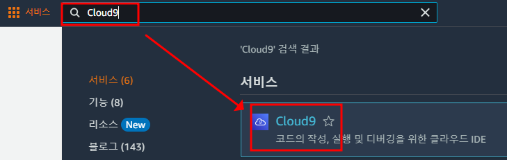
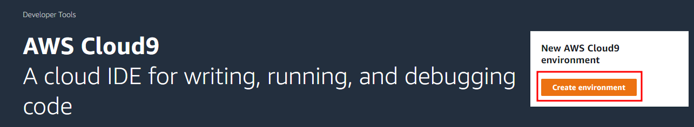
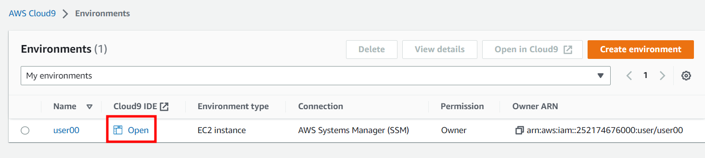
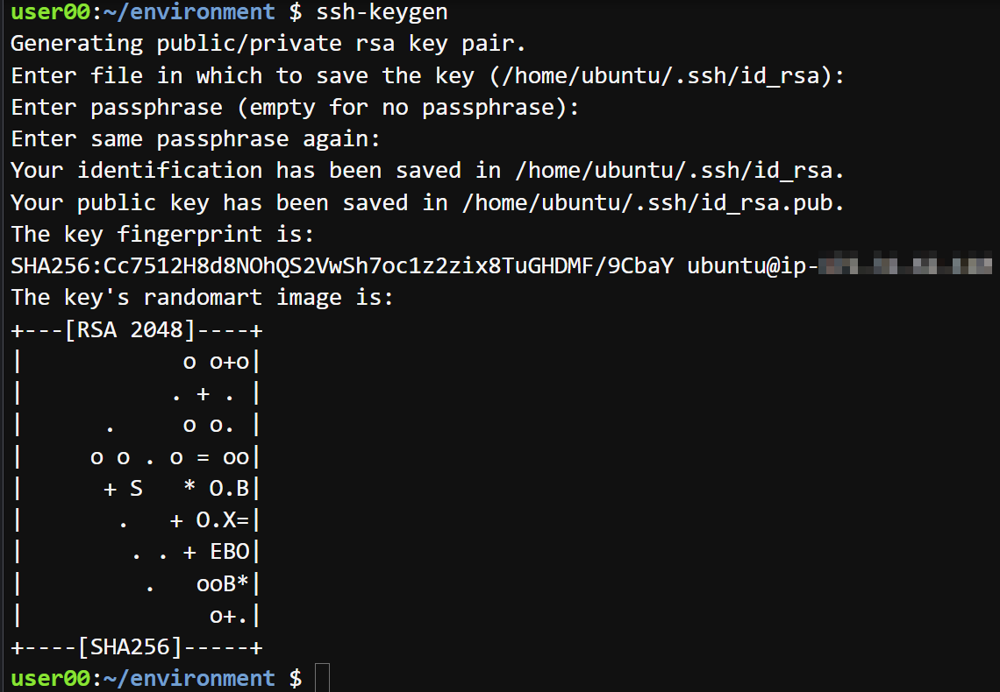
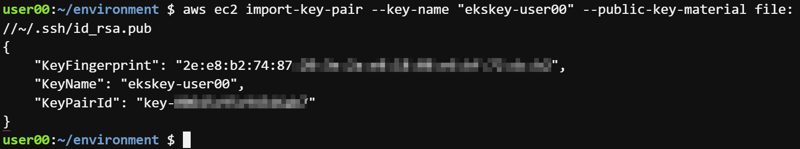
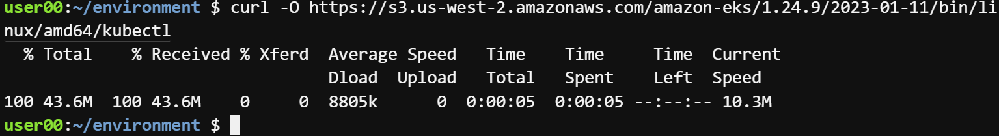
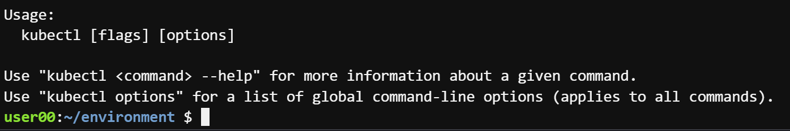
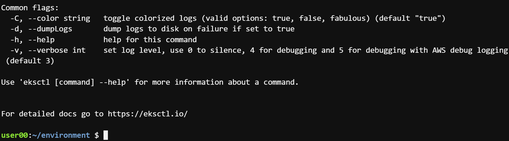

# Task 1 - Workspace 구성

1. AWS console - Cloud9 서비스



2. Create Environment을 클릭하고 아래 설정으로 입력 후 Create 클릭



> Name : user##

> Environment type : New EC2 instance

> Instance Type : t3.small

> Platform : Ubuntu Server 18.04 LTS

> 나머지는 기본값 유지

3. 생성한 뒤 open 클릭


4. Cloud9 에서 key 생성
(key는 작업자 노드 인스턴스에 ssh 액세스 시 사용)

```
ssh-keygen
```

> Enter 3번 입력하면 기본설정으로 key가 생성



5. 생성한 key를 aws ec2에 업로드

```
aws ec2 import-key-pair --key-name "ekskey-<user##>" --public-key-material file://~/.ssh/id_rsa.pub
```



6. kubectl 설치

```
curl -O https://s3.us-west-2.amazonaws.com/amazon-eks/1.24.9/2023-01-11/bin/linux/amd64/kubectl
```



7. kubectl 실행권한 부여 
```
chmod +x ./kubectl
```

8. 바이너리 복사 

```
mkdir -p $HOME/bin && cp ./kubectl $HOME/bin/kubectl && export PATH=$PATH:$HOME/bin
```

9. kubectl 설치 확인
```
kubectl
```



10. eksctl 설치

```
curl --silent --location "https://github.com/weaveworks/eksctl/releases/latest/download/eksctl_$(uname -s)_amd64.tar.gz" | tar xz -C /tmp
```

11. eksctl 명령어 등록
```
sudo mv /tmp/eksctl /usr/local/bin
```

12. eksctl 설치 확인
```
eksctl
```

