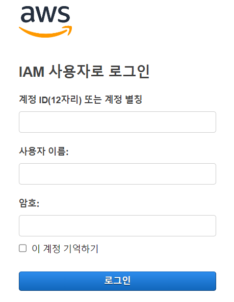

# Task 1 - Presetting

1. aws 로그인 

2. 우측 상단 리전을 서울로 변경

3. 상단 검색창에 Cloud9 입력후 해당 서비스로 이동

4. Create Environment을 클릭하고 아래 설정으로 입력 후 Create 클릭

> Name : user##

> Environment type : New EC2 instance

> Instance Type : t3.small

> Platform : Ubuntu Server 18.04 LTS

> 나머지는 기본값 유지

