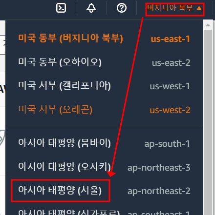

# Task 1 - Workspace 구성

1. aws 로그인 


2. 우측 상단 리전을 서울로 변경



3. 상단 검색창에 Cloud9 입력후 해당 서비스로 이동


4. Create Environment을 클릭하고 아래 설정으로 입력 후 Create 클릭


> Name : user##

> Environment type : New EC2 instance

> Instance Type : t3.small

> Platform : Ubuntu Server 18.04 LTS

> 나머지는 기본값 유지

5. Cloud9 에서 key 생성
(key는 작업자 노드 인스턴스에 ssh 액세스 시 사용)

```
ssh-keygen
```

> Enter 3번 입력하면 기본설정으로 key가 생성

6. 생성한 key를 aws ec2에 업로드

```
aws ec2 import-key-pair --key-name "ekskey" --public-key-material file://~/.ssh/id_rsa.pub
```

7. 
