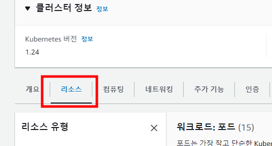

# Task 10 - Console 대시보드

> IAM, Dashboard

1. Cloud9에서 role ARN을 변수로 저장
```
rolearn=$(aws cloud9 describe-environment-memberships --environment-id=$C9_PID | jq -r '.memberships[].userArn')

echo ${rolearn}
```

> 만약 jq 패키지가 없으면 아래 명령으로 설치
```
sudo apt-get install -y jq
```

2. identity 매핑
```
eksctl create iamidentitymapping --cluster <user##>-cluster --arn ${rolearn} --group system:masters --username <user##>
```

3. AWS Console - EKS 서비스 - 클러스터 - user## 검색하여 클러스터 클릭


4. 리소스 탭을 클릭



콘솔에서 클러스터 오브젝트 확인되는 것을 확인 


5. 대시보드 설치
```
kubectl apply -f https://raw.githubusercontent.com/kubernetes/dashboard/v2.4.0/aio/deploy/recommended.yaml
```

6. Service Account 와 Rolebinding 배포

```
cat <<EOF | kubectl create -f -
apiVersion: v1
kind: ServiceAccount
metadata:
  name: eks-admin
  namespace: kube-system
---
apiVersion: rbac.authorization.k8s.io/v1
kind: ClusterRoleBinding
metadata:
  name: eks-admin
roleRef:
  apiGroup: rbac.authorization.k8s.io
  kind: ClusterRole
  name: cluster-admin
subjects:
- kind: ServiceAccount
  name: eks-admin
  namespace: kube-system
EOF
```

7. 토큰생성
```
cat <<EOF | kubectl apply -f -
apiVersion: v1
kind: Secret
metadata:
  name: eks-admin-token
  namespace: kube-system
  annotations:
    kubernetes.io/service-account.name: "eks-admin"
type: kubernetes.io/service-account-token
EOF
```

8. 프록시 오픈
```
kubectl proxy --port=8080 --address=0.0.0.0 --disable-filter=true &
```

9. Cloud9 메뉴중 -> Preview -> Preview Running Application 클릭하고, 

주소 뒤에 아래 주소 입력후 접속 
```
api/v1/namespaces/kubernetes-dashboard/services/https:kubernetes-dashboard:/proxy/
```

10. Cloud9 터미널에서 토큰 값 확인
```
kubectl describe secret -n kube-system eks-admin-token
```

11. 출력되는 토큰 값을 복사하여 대시보드 로그인

화면을 최대화 -> Browser 버튼 우측 버튼 클릭
