# Task 2 - Cloud9 역할 설정

> iam

1. AWS Console 상단 서비스 검색창에서 IAM 를 검색하여 IAM 서비스로 이동

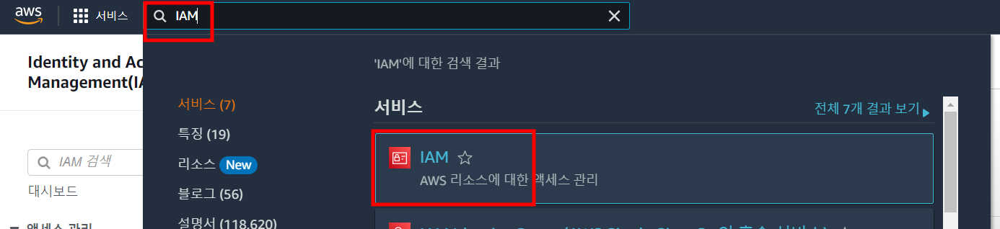

2. 좌측 메뉴 역할 클릭 후 우측 역할 만들기 클릭 

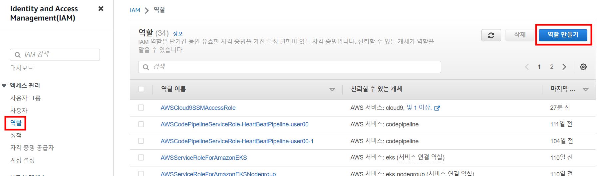

3. AWS Service 선택, EC2 선택 한 뒤 다음 클릭

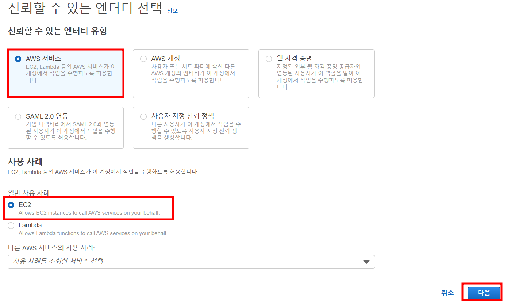

4. 정책 검색 란에 AdministratorAccess 를 검색하고 하단에 출력되는 정책 중 AdministratorAccess를 선택 한 뒤 다음 클릭 

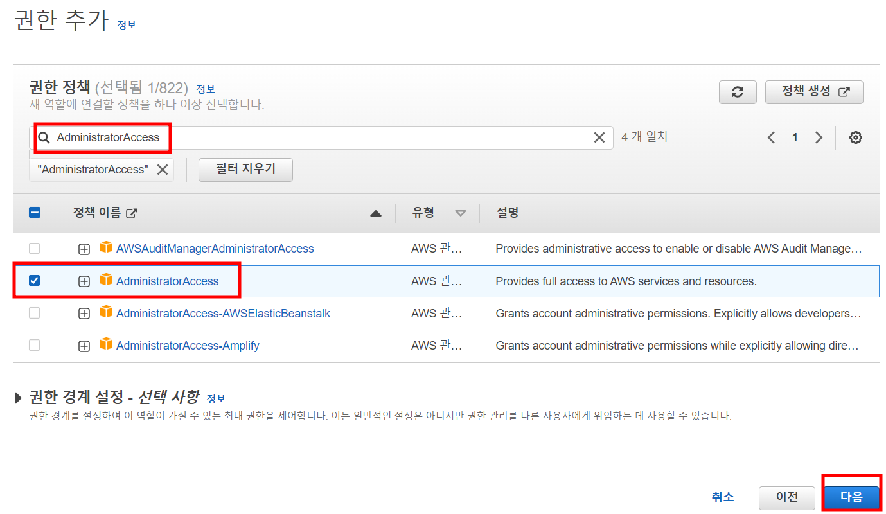

5. 역할 이름에 eks-admin-user## 를 입력한 뒤 하단 역할 생성 클릭

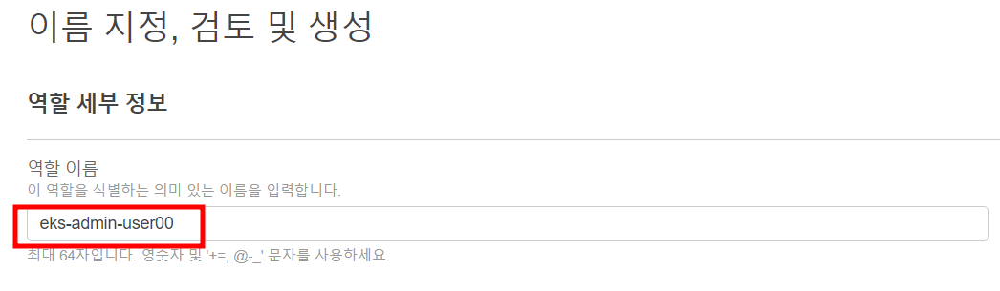

6. AWS Console 상단 서비스 검색창에서 EC2를 검색하여 EC2 서비스로 이동

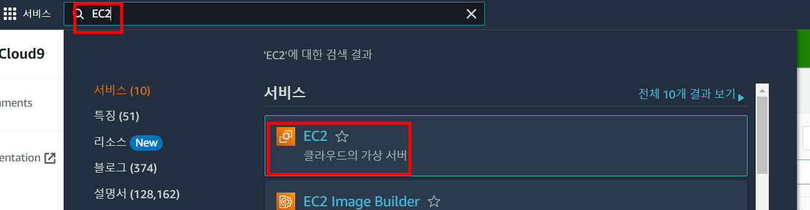

7. 상단 인스턴스 검색창에 user## 를 검색하여 하단에 출력되는 인스턴스를 선택하고 우측 작업 클릭, 보안 클릭, IAM 역할 수정 클릭 

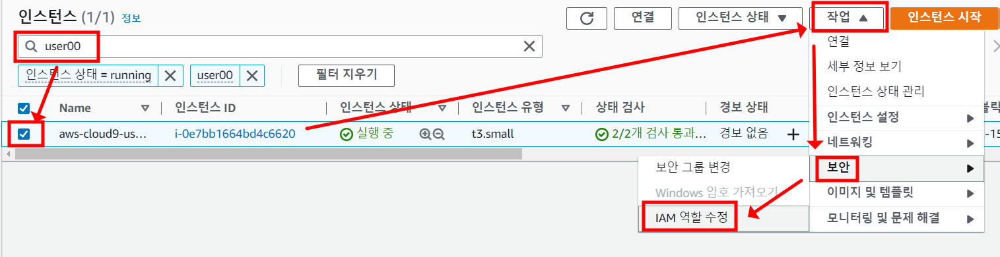

8. IAM 역할 선택 박스를 클릭, user## 입력하여 검색, 출력되는 eks-admin-user## 을 선택한 뒤 우측 하단 IAM 역할 업데이트 클릭

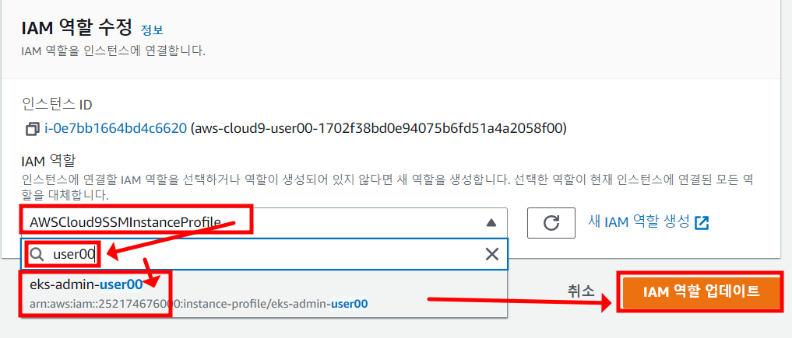

9. Task1 에서 생성했던 Cloud9 를 Open 하고 우측 상단 옵션(Preferences) 버튼을 클릭, AWS Settings 클릭, 우측 Credentials 의 AWS managed temporary credentials 기능 disable 

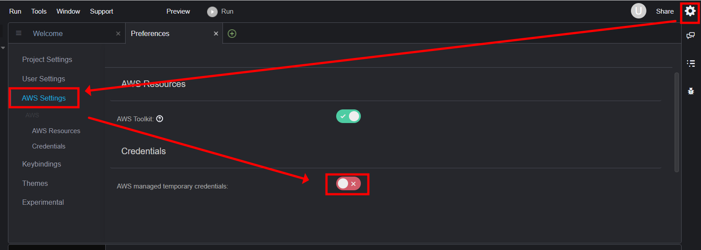

10. Cloud9 터미널에서 기존 자격증명 파일 제거
```
rm -vf ${HOME}/.aws/credentials
```

11. 리전 셋팅
```
aws configure set default.region $AWSREGION
aws configure get default.region
```

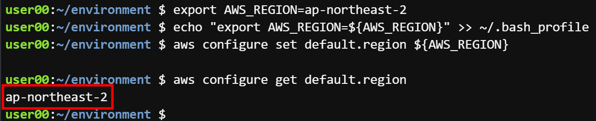

12. 역할 확인

```
aws iam get-instance-profile --instance-profile-name eks-admin-$ACCOUNT --query "InstanceProfile.Roles[0].RoleName" --output text
```

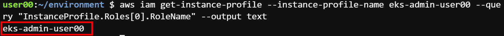

13. 결과비교 

```
aws sts get-caller-identity
```

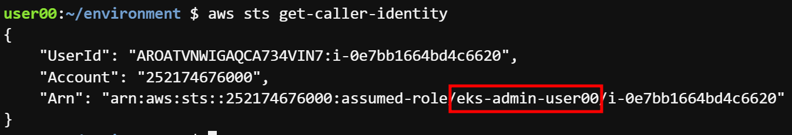