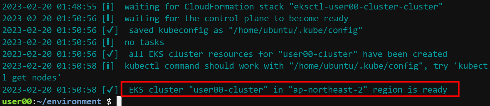
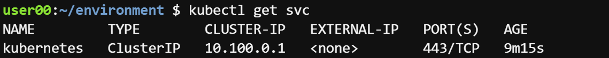
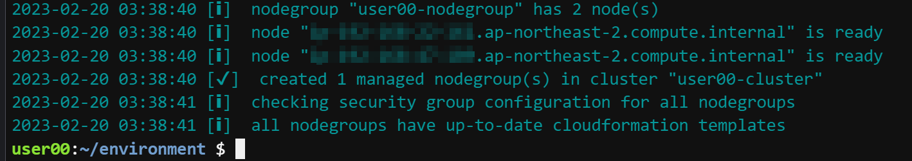
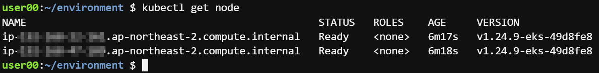

# Task 3 - eksctl 기반 eks 배포

1. 아래 명령으로 Cluster 배포 (10~15분 소요)

```
eksctl create cluster \
--name <user##-cluster> \
--region ap-northeast-2 \
--version 1.24 \
--without-nodegroup \
--with-oidc
```



* 참고(Cluster 삭제 명령어)

```
eksctl delete cluster --name=<user##>-cluster
```

2. Service 확인 
```
kubectl get svc
```



3. 만약 kubectl 명령이 정상동작 하지 않으면 아래 명령 진행 후 다시 2번 단계 수행
```
aws eks update-kubeconfig --region ap-northeast-2 --name <user##-cluster>
Added new context arn:aws:eks:ap-northeast-2:<aws accountid>:cluster/<user##-cluster> to /home/ubuntu/.kube/config
```

4. 키페어 생성 (워커노드 ssh 용)
```
aws ec2 create-key-pair --key-name <user##-key> --query 'KeyMaterial' --output text > <user##-key>.pem
```

5. NodeGroup 배포(5~8분 소요)
```
eksctl create nodegroup \
  --cluster <user##-cluster> \
  --region ap-northeast-2 \
  --name <user##-nodegroup> \
  --node-type t3.small \
  --nodes 2 \
  --nodes-min 2 \
  --nodes-max 5 \
  --node-volume-size 20 \
  --ssh-access \
  --ssh-public-key <user##-key>
```



* 참고(NodeGroup 삭제명령어)
```
eksctl delete nodegroup --cluster=<user##>-cluster --name=<user##>-nodegroup
```


6. Node 확인
```
kubectl get node
```



7. kubectl 자동완성 적용
```
source <(kubectl completion bash)
echo "source <(kubectl completion bash)" >> ~/.bashrc
source /etc/bash_completion
echo alias k=kubectl >> ~/.bashrc
source ~/.bashrc
complete -F __start_kubectl k
```


