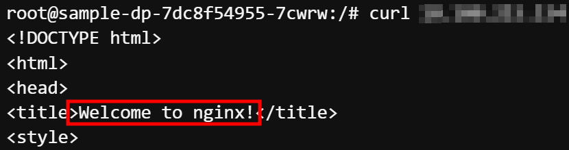

# Task 1 - Sample APP

> namespace, deployment, service

1. Namespace 생성 및 확인 
```
kubectl create ns sampleapp
```

```
kubectl get ns
```

2. Deployment 생성 및 확인
```
kubectl create deploy sample-dp --image=nginx --replicas=3 -n sampleapp
```

```
kubectl get deploy -n sampleapp
```
```
kubectl get rs -n sampleapp
```
```
kubectl get pod -n sampleapp
```

3. Deployment Pod 와 연결할 Service 생성 및 확인
```
kubectl expose deploy sample-dp --port=8080 --targetport=80 -n sampleapp
```

```
kubectl get svc -n sampleapp
```

4. 위에서 생성한 Pod로 접속 및 curl 테스트
```
kubectl -n sampleapp exec -it <2번에서 확인한 Any Pod Name> -- /bin/bash
```
```
curl <3번에서 확인한 clusterip>:8080
```




5. 만들었던 네임스페이스 삭제

```
kubectl delete ns sampleapp
```

