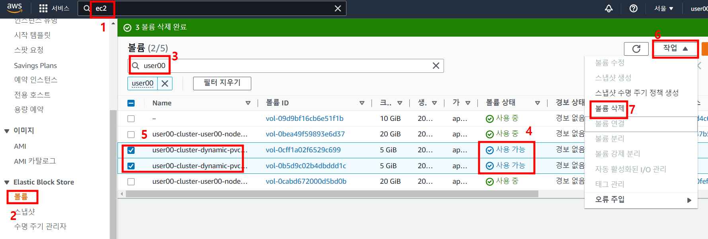

# Task 5 - PV/PVC with EBS

> pv, pvc, storageclass, ebs, csi driver

1. StorageClass 확인
```
kubectl get storageclass
kubectl get sc
```

2. EBS CSI 드라이버 IAM 역할 생성 
```
eksctl create iamserviceaccount \
  --name ebs-csi-controller-sa \
  --namespace kube-system \
  --cluster $ACCOUNT-cluster \
  --attach-policy-arn arn:aws:iam::aws:policy/service-role/AmazonEBSCSIDriverPolicy \
  --approve \
  --role-only \
  --role-name $ACCOUNT-AmazonEKS_EBS_CSI_DriverRole
```

3. EBS 드라이버 추가
```
eksctl create addon --name aws-ebs-csi-driver --cluster $ACCOUNT-cluster --service-account-role-arn arn:aws:iam::$AWSNUM:role/$ACCOUNT-AmazonEKS_EBS_CSI_DriverRole --force
```

* 참고(EBS 드라이버 삭제 명령어)
```
eksctl delete addon --cluster $ACCOUNT-cluster --name aws-ebs-csi-driver --preserve
```

4. pvc 생성 및 확인
```
cat <<EOF | kubectl create -f -
apiVersion: v1
kind: PersistentVolumeClaim
metadata:
  name: ebs-pvc
spec: 
  accessModes:
    - ReadWriteOnce
  storageClassName: gp2
  resources: 
    requests:
      storage: 5Gi
EOF
```

```
kubectl get pvc ebs-pvc
```

5. Pod 생성 및 확인 
```
cat <<EOF | kubectl create -f -
apiVersion: v1
kind: Pod
metadata:
  name: pv-pod
spec:
  containers:
  - name: container
    image: redis
    volumeMounts:
    - name: ebs-pv
      mountPath: /mount1
  volumes:
  - name : ebs-pv
    persistentVolumeClaim:
      claimName: ebs-pvc
EOF
```

```
kubectl get pod pv-pod
```

6. 자동 생성된 pv 확인
```
kubectl get pv
```

7. 5번에서 생성한 pod로 접속 및 테스트 파일 생성
```
kubectl exec -it pv-pod -- /bin/bash
```
```
cd /mount1
echo hello ebs-pv >> test.txt
cat test.txt
exit
```

8. 5번에서 생성한 pod를 삭제 후 재 생성 
```
kubectl delete pod pv-pod
```

```
cat <<EOF | kubectl create -f -
apiVersion: v1
kind: Pod
metadata:
  name: pv-pod
spec:
  containers:
  - name: container
    image: redis
    volumeMounts:
    - name: ebs-pv
      mountPath: /mount1
  volumes:
  - name : ebs-pv
    persistentVolumeClaim:
      claimName: ebs-pvc
EOF
```

9. 다시 접속후 파일 확인
```
kubectl exec -it pv-pod -- /bin/bash
```
```
cd /mount1
cat test.txt
exit
```

10. Pod 삭제 및 PVC 삭제
```
kubectl delete pod pv-pod
kubectl delete pvc ebs-pvc
```

11. 삭제 확인
```
kubectl get pod,pv,pvc
```

12. StorageClass 생성
```
cat <<EOF | kubectl create -f -
apiVersion: storage.k8s.io/v1
kind: StorageClass
metadata:
  name: gp2-2
parameters:
  fsType: ext4
  type: gp2
provisioner: kubernetes.io/aws-ebs
reclaimPolicy: Retain
volumeBindingMode: Immediate
EOF
```

13. gp2-2 를 사용하는 pvc 생성 및 확인
```
cat <<EOF | kubectl create -f -
apiVersion: v1
kind: PersistentVolumeClaim
metadata:
  name: ebs-pvc2
spec: 
  accessModes:
    - ReadWriteOnce
  storageClassName: gp2-2
  resources: 
    requests:
      storage: 5Gi
EOF
```

14. 13번에서 생성한 pvc 삭제 및 확인 
```
kubectl delete pvc ebs-pvc2
```

```
kubectl get pvc,pv
```

15. Released 된 pv에 연결하기 위해 pvc 재 생성 및 확인 

```
cat <<EOF | kubectl create -f -
apiVersion: v1
kind: PersistentVolumeClaim
metadata:
  name: ebs-pvc2
spec: 
  accessModes:
    - ReadWriteOnce
  storageClassName: gp2-2
  resources: 
    requests:
      storage: 5Gi
EOF
```

``` 
kubectl get pv,pvc
```

기존 pv에 연결되는 것이아니라 pv를 새롭게 하나 더 생성됨을 확인


16. 기존 pv를 yaml 파일로 생성
```
kubectl get pv <Released 상태의 pv name> -o yaml > pv.yaml
```

17. pv.yaml 파일을 열어 아래 부분 삭제

> 최하단 
```
status:
  phase: Released
```
> 약 26 line 
```
  claimRef:
    apiVersion: v1
    kind: PersistentVolumeClaim
    name: ebs-pvc2
    namespace: default
    resourceVersion: "5~~~~"
    uid: e01988ef-08d~~~
```
18. 다시 pvc, pv 삭제
```
kubectl delete pvc,pv --all
```

19. 17번에서 생성한 pv.yaml로 생성
```
kubectl create -f pv.yaml
```

20. 다시 pvc 생성
```
cat <<EOF | kubectl create -f -
apiVersion: v1
kind: PersistentVolumeClaim
metadata:
  name: ebs-pvc2
spec: 
  accessModes:
    - ReadWriteOnce
  storageClassName: gp2-2
  resources: 
    requests:
      storage: 5Gi
EOF
```

21. 19,20 번에서 생성한 pv,pvc가 연결됨을 확인
```
kubectl get pv,pvc
```

22. 생성했던 리소스 삭제
```
kubectl delete pv,pvc --all
```

23. AWS Console - EC2 서비스 - EBS - 볼륨 - 사용 가능 상태의  user##-cluster-dynamic-pvc 이름을 가진 볼륨 삭제 

