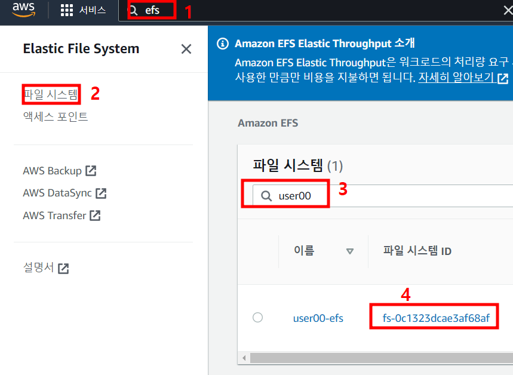
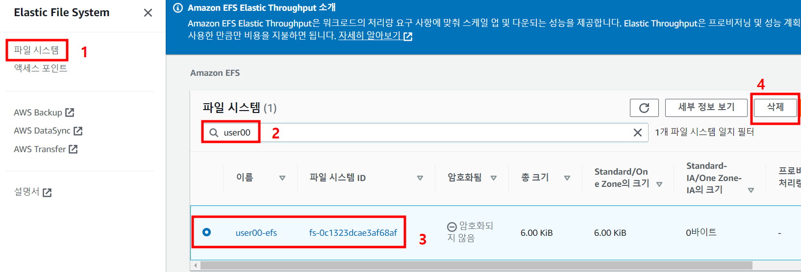

# Task 6 - PV/PVC with EFS

1. EFS CSI 드라이버 배포를 위한 IAM 정책 생성

IAM 문서 다운로드
```
curl -O https://raw.githubusercontent.com/kubernetes-sigs/aws-efs-csi-driver/master/docs/iam-policy-example.json
```

정책 생성
```
aws iam create-policy \
    --policy-name <user##>_AmazonEKS_EFS_CSI_Driver_Policy \
    --policy-document file://iam-policy-example.json
```

2. 1번에서 생성한 정책을 사용하여 IAM 역할과 k8s Service Account 생성
```
eksctl create iamserviceaccount \
    --cluster <user##>-cluster \
    --namespace kube-system \
    --name efs-csi-controller-sa \
    --attach-policy-arn arn:aws:iam::<AWS Account Number>:policy/<user##>_AmazonEKS_EFS_CSI_Driver_Policy \
    --approve \
    --region ap-northeast-2
```

3. EFS CSI 드라이버 배포 yaml 다운로드
```
kubectl kustomize \
    "github.com/kubernetes-sigs/aws-efs-csi-driver/deploy/kubernetes/overlays/stable/?ref=release-1.4" > public-ecr-driver.yaml
```

4. 다운로드 받은 public-ecr-driver.yaml 파일을 수정 

> 1번 라인 부근 아래 부분을 삭제 (이전단계에서 Service Account 를 이미 생성 했음)
```
apiVersion: v1
kind: ServiceAccount
metadata:
  labels:
    app.kubernetes.io/name: aws-efs-csi-driver
  name: efs-csi-controller-sa
  namespace: kube-system
---
```

5. 수정한 yaml 배포
```
kubectl apply -f public-ecr-driver.yaml
```

6. 클러스터가 존재하는 vpc id를 검색 하여 변수에 저장
```
vpc_id=$(aws eks describe-cluster \
    --name <user##>-cluster \
    --query "cluster.resourcesVpcConfig.vpcId" \
    --output text)
```

7. 클러스터가 존재하는 VPC CIDR 값을 검색하여 변수에 저장
```
cidr_range=$(aws ec2 describe-vpcs \
    --vpc-ids $vpc_id \
    --query "Vpcs[].CidrBlock" \
    --output text \
    --region ap-northeast-2)
```

8. NFS 트래픽 허용 보안그룹 생성
```
security_group_id=$(aws ec2 create-security-group \
    --group-name <user##>-EfsSG \
    --description "<user##>-EfsSG" \
    --vpc-id $vpc_id \
    --output text)
```

9. 인바운드 규칙 생성
```
aws ec2 authorize-security-group-ingress \
    --group-id $security_group_id \
    --protocol tcp \
    --port 2049 \
    --cidr $cidr_range
```

10. EFS 파일시스템 생성
```
file_system_id=$(aws efs create-file-system \
    --region ap-northeast-2 \
    --performance-mode generalPurpose \
    --query 'FileSystemId' \
    --tags Key=Name,Value=<user##>-efs \
    --output text)
```

11. Node의 IP 확인
```
kubectl get nodes
```

12. VPC 서브넷 ID와 AZ 확인
```
aws ec2 describe-subnets \
    --filters "Name=vpc-id,Values=$vpc_id" \
    --query 'Subnets[*].{SubnetId: SubnetId,AvailabilityZone: AvailabilityZone,CidrBlock: CidrBlock}' \
    --output table
```

13. EFS 탑재 대상 추가 (각각 실행)
```
aws efs create-mount-target \
    --file-system-id $file_system_id \
    --subnet-id <12번에서 확인한 SUBNET ID 중 11번의 노드의 IP가 속해있는 SUBNET ID> \
    --security-groups $security_group_id
```    

14. AWS Console - EFS 서비스 - 파일시스템 - user## 검색 - 파일시스템 id을 복사하여 메모장에 저장 



15. EFS StorageClass 배포
```
cat <<EOF | kubectl create -f -
apiVersion: storage.k8s.io/v1
kind: StorageClass
metadata:
  name: efs-sc
provisioner: efs.csi.aws.com
parameters:
  provisioningMode: efs-ap
  fileSystemId: <14번에서 저장한 id 값>
  directoryPerms: "700"
  gidRangeStart: "1000" # optional
  gidRangeEnd: "2000" # optional
  basePath: "/dynamic_provisioning" # optional
EOF
```

16. PVC와 Pod 생성
```
cat <<EOF | kubectl create -f -
apiVersion: v1
kind: PersistentVolumeClaim
metadata:
  name: efs-pvc
spec:
  accessModes:
    - ReadWriteMany
  storageClassName: efs-sc
  resources:
    requests:
      storage: 5Gi
---
apiVersion: v1
kind: Pod
metadata:
  name: efs-pod1
spec:
  containers:
    - name: app
      image: redis
      volumeMounts:
        - name: efs-pv
          mountPath: /mount1
  volumes:
    - name: efs-pv
      persistentVolumeClaim:
        claimName: efs-pvc
---
apiVersion: v1
kind: Pod
metadata:
  name: efs-pod2
spec:
  containers:
    - name: app
      image: redis
      volumeMounts:
        - name: efs-pv
          mountPath: /mount2
  volumes:
    - name: efs-pv
      persistentVolumeClaim:
        claimName: efs-pvc        
EOF
```

17. efs-pod1 로 접속 및 테스트 파일 생성
```
kubectl exec -it efs-pod1 -- /bin/bash
```
```
cd /mount1
echo hello efs > test.txt
exit
```

18. efs-pod2 로 접속 및 테스트 파일 확인
```
kubectl exec -it efs-pod2 -- /bin/bash
```
```
cd /mount2
echo test.txt
exit
```

19. 생성했던 리소스 삭제
```
kubectl delete pod,pvc --all
```

20. AWS Console - EFS 서비스 - 파일시스템 - user## 검색 - 하단 나오는 파일시스템 선택 한뒤 삭제



