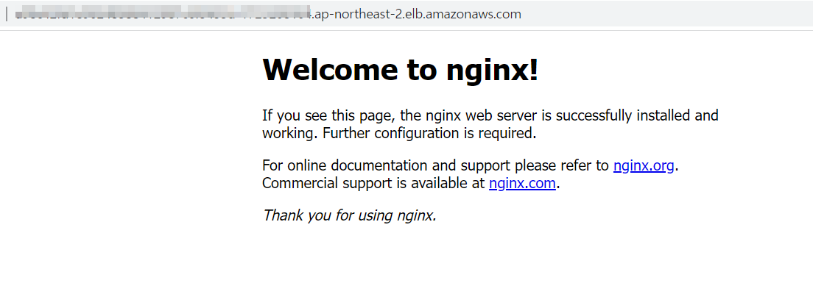
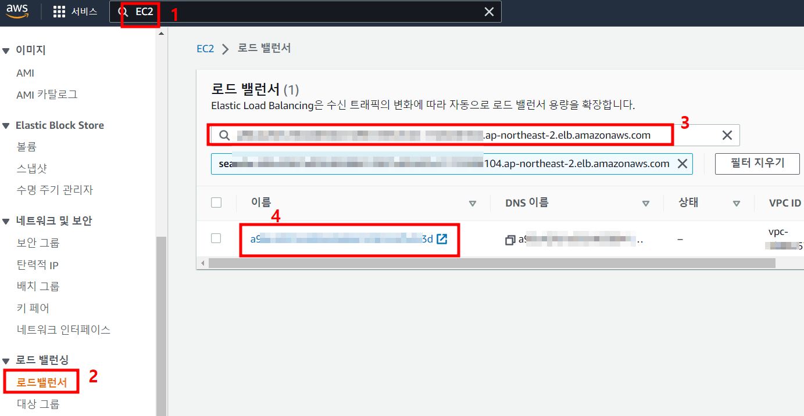
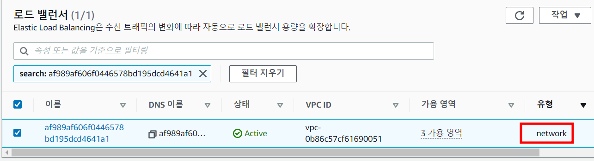

# Task 7 - Loadbalancer Serivce & Ingress

> lb service, ingress, alb ingress controller

1. Pod 생성
```
kubectl run lb-pod --image=nginx
```

2. LB Serivce 생성 및 확인
```
kubectl expose pod lb-pod --port=80 --type=LoadBalancer
```
```
kubectl get svc
```

3. External-IP 에  출력되는 주소를 웹브라우저에서 접속



4. AWS Console - EC2 서비스 - 로드밸런서 - 검색란에 2번에서 확인한 주소를 검색 - 하단 나오는 lb를 클릭하여 정보 확인



5. NLB를 사용하는 LB Service 생성 및 확인 
```
cat <<EOF | kubectl create -f -
apiVersion: v1
kind: Service
metadata:
  name: nlb-svc
  labels:
    run: lb-pod
  annotations:
    service.beta.kubernetes.io/aws-load-balancer-type: "nlb"
spec:
  type: LoadBalancer 
  selector:
    run: lb-pod    
  ports:
  - port: 80
    targetPort: 80
EOF
```
```
kubectl get svc nlb-svc
```


6. 4번에서 확인한 페이지에서 5번에서 확인되는 External-IP 의 주소를 검색 - NLB 인것을 확인



7. 웹브라우저에서 위 주소로 접속 nginx 페이지 확인

8. ALBC (AWS Load Balancer Controller) 에 부여할 IAM 정책 생성
```
curl -o iam-policy.json https://raw.githubusercontent.com/kubernetes-sigs/aws-load-balancer-controller/v2.4.4/docs/install/iam_policy.json
```

```
aws iam create-policy \
    --policy-name <user##>-AWSLoadBalancerControllerIAMPolicy \
    --policy-document file://iam-policy.json
```

9. ALBC 에 사용할 k8s ServiceAccount 생성
```
eksctl create iamserviceaccount \
    --cluster <user##>-cluster \
    --namespace kube-system \
    --name aws-load-balancer-controller \
    --attach-policy-arn arn:aws:iam::<AWS account number>:policy/<user##>-AWSLoadBalancerControllerIAMPolicy \
    --override-existing-serviceaccounts \
    --approve
```

10. 인증서 구성을 위한 Cert-manager 설치
```
kubectl apply --validate=false -f https://github.com/jetstack/cert-manager/releases/download/v1.5.4/cert-manager.yaml
```

11. ALBC 배포 yaml 다운로드
```
wget https://github.com/kubernetes-sigs/aws-load-balancer-controller/releases/download/v2.4.4/v2_4_4_full.yaml
```

12. yaml 파일 편집 (클러스터 명 수정)
```
spec:
    containers:
    - args:
        - --cluster-name=<user##>-cluster 
        - --ingress-class=alb
        image: amazon/aws-alb-ingress-controller:v2.4.4
```

13. yaml 파일 편집 (하기 부분 삭제)
```
---
apiVersion: v1
kind: ServiceAccount
metadata:
  labels:
    app.kubernetes.io/component: controller
    app.kubernetes.io/name: aws-load-balancer-controller
  name: aws-load-balancer-controller
  namespace: kube-system
```

14. yaml 배포
```
kubectl apply -f v2_4_4_full.yaml
```

15. 정상동작 확인(running 상태)
```
kubectl get deployment -n kube-system aws-load-balancer-controller
```

16. aws ECR 레포지토리 생성
```
aws ecr create-repository \
--repository-name <user##>-repo1 \
--image-scanning-configuration scanOnPush=true \
--region ap-northeast-2
```
```
aws ecr create-repository \
--repository-name <user##>-repo2 \
--image-scanning-configuration scanOnPush=true \
--region ap-northeast-2
```
```
aws ecr create-repository \
--repository-name <user##>-repo3 \
--image-scanning-configuration scanOnPush=true \
--region ap-northeast-2
```

17. 푸시작업을 위한 인증토큰 가져오기, 인증토큰 전달
```
aws ecr get-login-password --region ap-northeast-2 | docker login --username AWS --password-stdin <AWS ACCOUNT number>.dkr.ecr.ap-northeast-2.amazonaws.com
```

18. 로드밸런싱 테스트를 위한 컨테이너 이미지 생성
```
mkdir /home/ubuntu/environment/repo1
cd /home/ubuntu/environment/repo1
```
```
cat << EOF > Dockerfile
FROM nginx:latest
RUN  echo '<h1> nginx 1 page </h1>'  >> index.html
RUN mkdir -p /usr/share/nginx/html/repo1
RUN cp /index.html /usr/share/nginx/html/repo1
EOF
```
```
docker build -t repo1 .
```

19. 푸시 설정을 위한 태깅
```
docker tag repo1:latest <AWS ACCOUNT number>.dkr.ecr.ap-northeast-2.amazonaws.com/<user##>-repo1:latest
```

20. 푸시
```
docker push <AWS account Number>.dkr.ecr.$AWS_REGION.amazonaws.com/<user##>-repo1:latest
```

21. 로드밸런싱 테스트를 위한 컨테이너 이미지 생성 -2 
```
mkdir /home/ubuntu/environment/repo2
cd /home/ubuntu/environment/repo2
```
```
cat << EOF > Dockerfile
FROM nginx:latest
RUN  echo '<h1> nginx 2 page </h1>'  >> index.html
RUN mkdir -p /usr/share/nginx/html/repo2
RUN cp /index.html /usr/share/nginx/html/repo2
EOF
```
```
docker build -t repo2 .
```

22. 푸시 설정을 위한 태깅
```
docker tag repo2:latest <AWS ACCOUNT number>.dkr.ecr.ap-northeast-2.amazonaws.com/<user##>-repo2:latest
```

23. 푸시
```
docker push <AWS account Number>.dkr.ecr.$AWS_REGION.amazonaws.com/<user##>-repo2:latest
```

24. 로드밸런싱 테스트를 위한 컨테이너 이미지 생성 -3 
```
mkdir /home/ubuntu/environment/repo3
cd /home/ubuntu/environment/repo3
```
```
cat << EOF > Dockerfile
FROM nginx:latest
RUN  echo '<h1> nginx 3 page </h1>'  >> index.html
RUN mkdir -p /usr/share/nginx/html/repo3
RUN cp /index.html /usr/share/nginx/html/repo3/index.html
EOF
```
```
docker build -t repo3 .
```

25. 푸시 설정을 위한 태깅
```
docker tag repo3:latest <AWS ACCOUNT number>.dkr.ecr.ap-northeast-2.amazonaws.com/<user##>-repo3:latest
```

26. 푸시
```
docker push <AWS account Number>.dkr.ecr.ap-northeast-2.amazonaws.com/<user##>-repo3:latest
```

27. 로드밸런싱을 위한 pod, svc 생성
```
cat <<EOF | kubectl create -f -
apiVersion: v1
kind: Pod
metadata:
  name: repo1
  labels:
    app: repo1
spec:
  containers:
  - name: container
    image: <AWS account Number>.dkr.ecr.ap-northeast-2.amazonaws.com/user00-repo1
---
apiVersion: v1
kind: Pod
metadata:
  name: repo2
  labels:
    app: repo2
spec:
  containers:
  - name: container
    image: <AWS account Number>.dkr.ecr.ap-northeast-2.amazonaws.com/user00-repo2
---
apiVersion: v1
kind: Pod
metadata:
  name: repo3
  labels:
    app: repo3
spec:
  containers:
  - name: container
    image: <AWS account Number>.dkr.ecr.ap-northeast-2.amazonaws.com/user00-repo3
---
apiVersion: v1
kind: Service
metadata:
  name: repo1-svc
spec:
  selector:
    app: repo1
  ports:
  - port: 8080
    targetPort: 80
---
apiVersion: v1
kind: Service
metadata:
  name: repo2-svc
spec:
  selector:
    app: repo2
  ports:
  - port: 8080
    targetPort: 80
---
apiVersion: v1
kind: Service
metadata:
  name: repo3-svc
spec:
  selector:
    app: repo3
  ports:
  - port: 8080
    targetPort: 80
EOF
```

28. ingress 생성
```
cat <<EOF | kubectl create -f -
apiVersion: networking.k8s.io/v1
kind: Ingress
metadata:
  name: lb-ingress
  annotations:
    alb.ingress.kubernetes.io/scheme: internet-facing
    alb.ingress.kubernetes.io/target-type: ip
    kubernetes.io/ingress.class: alb
spec:
  rules:
  - http:
      paths:
      - path: /repo1
        pathType: Prefix
        backend:
          service:
            name: repo1-svc
            port:
              number: 8080
      - path: /repo2
        pathType: Prefix
        backend:
          service:
            name: repo2-svc
            port:
              number: 8080
      - path: /repo3
        pathType: Prefix
        backend:
          service:
            name: repo3-svc
            port:
              number: 8080
EOF
```

29. ingress 생성 확인 및 Console 확인
```
kubectl get ingress
kubectl describe ingress
```

AWS Console - EC2 서비스 - 로드밸런서 - 위에서 확인된 ingress의 DNS 주소를 검색 

30. 웹브라우저에서 위 주소로 접속 테스트
```
http://<ingress dns>/repo1
http://<ingress dns>/repo2
http://<ingress dns>/repo3
```

31. 실습 정리 
```
kubectl delete ingress,pod,svc --all
```