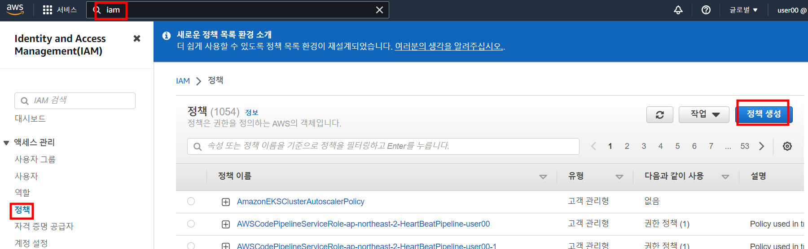
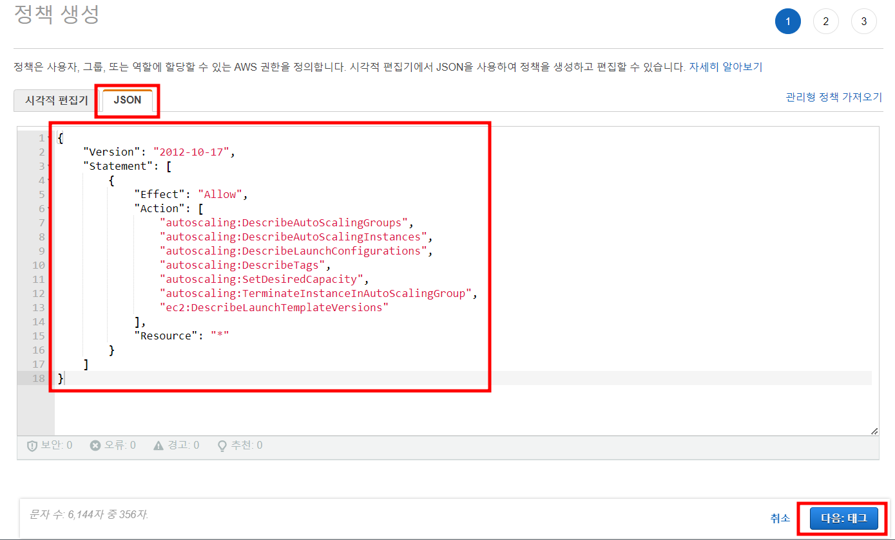
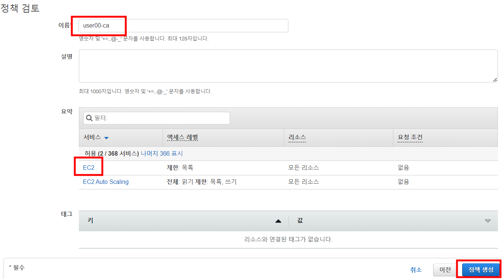
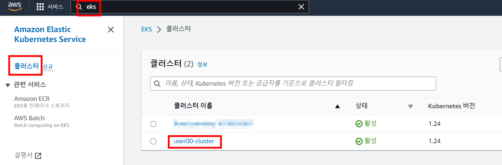
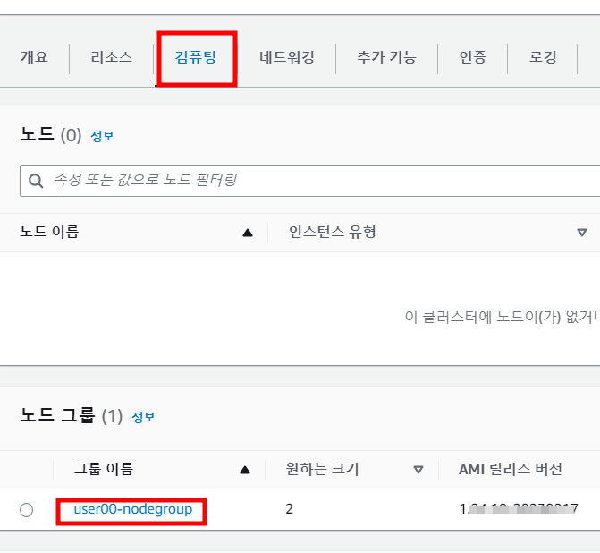
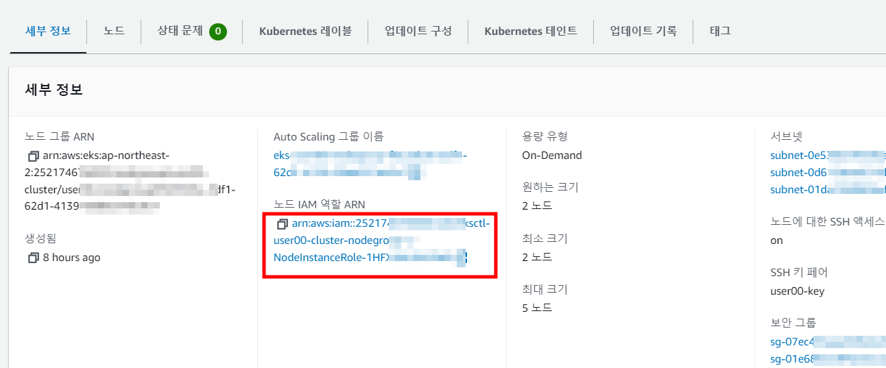
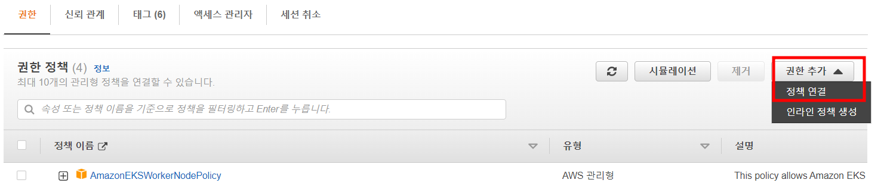
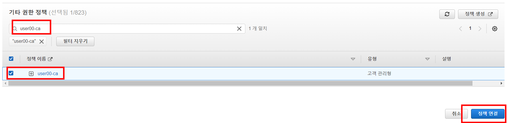

# Task 9 - VPA, CA

1. 샘플 리포지토리 다운로드
```
git clone https://github.com/kubernetes/autoscaler.git
```

2. 디렉토리 이동
```
cd autoscaler/vertical-pod-autoscaler/
```

3. VPA 컨트롤러 배포
```
./hack/vpa-up.sh
```

4. VPA 컨트롤러 확인 (vpa로 시작하는 Pod의 running 상태)
```
kubectl get pods -n kube-system
```

5. VPA 배포 yaml 확인 및 배포
```
cat examples/hamster.yaml
```
```
kubectl apply -f examples/hamster.yaml
```

6. 배포 확인 
```
kubectl get pods -l app=hamster
```

7. 배포된 Pod의 리소스 정보 확인
```
kubectl describe pod <6번에서 확인한 Pod 명>
```

8. 1~2분 뒤 Pod 재확인
```
kubectl get pods -l app=hamster
```
> Pod가 재배포 되었다는것을 확인

9. 다시 Pod의 리소스 정보 확인
```
kubectl describe pod <8번에서 확인한 Pod 명>
```

10. VPA 실습 정리
```
kubectl delete -f examples/hamster.yaml
```

11. CA를 위한 ASG 값 확인
```
aws autoscaling \
    describe-auto-scaling-groups \
    --query "AutoScalingGroups[? Tags[? (Key=='eks:cluster-name') && Value=='<user##>-cluster']].[AutoScalingGroupName, MinSize, MaxSize,DesiredCapacity]" \
    --output table
```

12. AWS Console - IAM 서비스 - 정책 - 정책 생성 클릭



13. Json 탭을 클릭한 뒤 아래 내용으로 정책 내용을 수정
```
{
    "Version": "2012-10-17",
    "Statement": [
        {
            "Effect": "Allow",
            "Action": [
                "autoscaling:DescribeAutoScalingGroups",
                "autoscaling:DescribeAutoScalingInstances",
                "autoscaling:DescribeLaunchConfigurations",
                "autoscaling:DescribeTags",
                "autoscaling:SetDesiredCapacity",
                "autoscaling:TerminateInstanceInAutoScalingGroup",
                "ec2:DescribeLaunchTemplateVersions"
            ],
            "Resource": "*"
        }
    ]
}
```
그리고 다음 클릭



14. 태그추가는 생략하고 다음 클릭

15. 이름에 <user##>-ca 입력 한뒤 EC2 를 클릭하고 정책 생성 클릭



16. AWS Console - EKS 서비스 - 클러스터 - user##-cluster 를 선택



17. 컴퓨팅 - 노드그룹 클릭



18. Node IAM Role ARN 링크를 클릭 



19. 권한 추가 - 정책 연결 클릭



20. 검색란에 user##-ca 검색, 하단 정책 선택 한 뒤 정책 연결 클릭



21. Cloud9 으로 돌아와서 CA 배포 파일 다운로드
```
wget https://raw.githubusercontent.com/kubernetes/autoscaler/master/cluster-autoscaler/cloudprovider/aws/examples/cluster-autoscaler-autodiscover.yaml
```

22. yaml 오픈하여 command 의 <YOUR CLUSTER NAME>을 user##-cluster 로 변경 

```
        command:
            - ./cluster-autoscaler
            - --v=4
            - --stderrthreshold=info
            - --cloud-provider=aws
            - --skip-nodes-with-local-storage=false
            - --expander=least-waste
            - --node-group-auto-discovery=asg:tag=k8s.io/cluster-autoscaler/enabled,k8s.io/cluster-autoscaler/<YOUR CLUSTER NAME>
```

23. 배포
```
kubectl apply -f cluster-autoscaler-autodiscover.yaml
```

24. 새 터미널을 오픈하여 노드 확인 명령 수행 
```
watch -n 0.1 kubectl get node
```

25. 기존 터미널에서 Deployment 생성 및 replicas 수정
```
kubectl create deployment autoscaler-demo --image=nginx
kubectl scale deployment autoscaler-demo --replicas=100
```

26. Deployment 의 Pod 배포 현황 확인
```
watch -n 0.1 kubectl get deploy
```

27. 24번에서 만든 터미널에서 node가 새로 추가 되었는지 확인

28. 25번에서 생성한 Deployment 삭제
```
kubectl delete deployment autoscaler-demo
```

29. 일정 시간 후 24번 터미널에서 노드가 삭제된 것을 확인

30. 실습 정리
```
kubectl delete -f cluster-autoscaler-autodiscover.yaml
```
